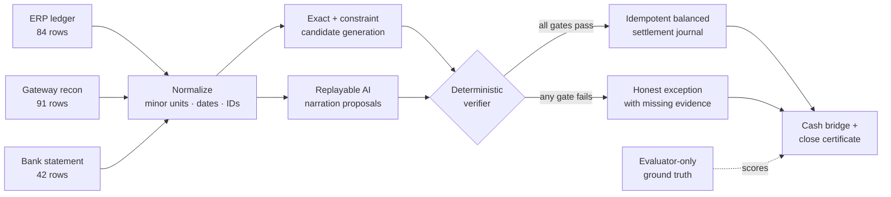

# SettleProof

> Every rupee accounted for. Every exception admitted.


SettleProof is an evidence-first AI finance controller for Razorpay Buildathon Track 04. It closes one bounded loop:

`ERP order → gateway recon row → settlement batch → bank credit → balanced journal → cash position`

The model is allowed to interpret messy narration and propose a typed reference. It is **not** allowed to do arithmetic or authorize a posting. A deterministic verifier proves every write and abstains when evidence is incomplete or ambiguous.

## Verified result

All figures below are generated by `npm run evaluate`; none are typed into the dashboard by hand.

| Measure | Result | Denominator |
| --- | ---: | --- |
| Source rows processed | **217** | 84 ERP + 91 gateway + 42 bank |
| Reconciliation targets | **84** | complete target population |
| Correct auto-matches | **78** | independently scored against truth |
| Safe match rate | **92.9%** | 78 correct auto-matches / 84 targets |
| Auto-match precision | **100%** | 78 correct / 78 auto-matches |
| Match recall | **100%** | 78 correct / 78 truly matchable |
| Value-weighted coverage | **87.5%** | correctly closed INR / total target INR |
| Exceptions surfaced | **6 / 6** | one of each injected control break |
| False auto-closes | **0** | unsafe financial writes |
| Seeded verifier regression | **25 seeds / 5,425 rows** | fixed scenarios; values and operating noise vary |
| Stress replay | **50,127 rows** | measured throughput in [`benchmark.json`](artifacts/benchmark.json) |

The six unresolved cases are not hidden from the rate:

1. ERP payment with no gateway evidence
2. ₹500 gateway/ledger amount variance
3. two same-value candidates with no decisive reference
4. duplicate gateway capture/webhook replay
5. processed settlement missing from the bank
6. one UTR appearing as two bank credits

See the complete machine-readable list in [`exceptions.csv`](artifacts/exceptions.csv).

## Run it

Requires Node.js 22.13+ (Node 24 recommended).

```bash
npm ci
npm run dev
```

Open `http://localhost:3000`. Use **Replay 217-row close** for the scored benchmark, or **Use your data** to run the same verifier on local files.

To reproduce every score and artifact:

```bash
npm run evaluate
npm run test
npm run build
```

Or run the complete check:

```bash
npm run verify
```

## Use your own raw data

The dashboard now includes a real browser-local ingestion loop. Files are parsed and reconciled in the browser; they are not uploaded or persisted.

1. Click **Use your data**.
2. Select three CSV/JSON exports, import one JSON pack, or choose **Load example raw files**.
3. Review the detected field map, source SHA-256 hashes, row counts, control totals, and validation findings.
4. Set the close cutoff and optional opening bank balance.
5. Run the verified close and export its input-bound proof packet.

The example-file path serializes the synthetic batch into three raw CSVs and sends all 217 rows through the exact same parser as user files. It does not jump back to the seed.

| Source | Minimum detected fields |
| --- | --- |
| ERP ledger | order ID, booked date, amount; receipt/customer/expected settlement optional |
| Gateway recon | type, created date, settlement ID, credit, debit; order ID or narration required |
| Bank statement | posted date, credit/debit direction, amount; UTR and narration optional |

IDs can be generated from source line numbers, ERP settlement IDs are optional, and bank settlement kind can be derived from credit/UTR evidence. Amounts are converted with string arithmetic to integer paise. Formula-like cells, ambiguous columns, invalid dates, non-INR rows, duplicate source IDs, malformed amounts, and files over the row/size limits block the run instead of disappearing.

Custom files do not contain evaluator-only truth labels, so their dashboard deliberately shows operational close rate, value reconciled, row disposition, balanced journals, and verifier invariants—never synthetic precision, recall, or false-close claims. Measured accuracy remains isolated in **Benchmark & audit**.

## What the demo proves

The interface is a working close command center, not a landing page or chatbot.

- **Close overview** — count- and value-weighted metrics, cash bridge, proof invariants, and residual exposure.
- **Bring-your-own-data wizard** — real CSV/JSON parsing, mappings, validation, control totals, hashes, close policy, and local-only processing.
- **Evidence ledger** — every safe match links ERP, gateway, settlement, bank, policy gates, and the posted journal.
- **Exception inbox** — every abstention includes the exact blocker, missing evidence, exposure, and safest next action.
- **Benchmark & audit** — seeded regression, rules-vs-agent ablation, formulas, throughput, limitations, and downloadable proof files.
- **Proof packet export** — one JSON bundle containing the run manifest, metrics, decisions, journals, and close certificate.

## Architecture



The verifier checks:

1. integer-paise amount equality within the INR-scoped batch;
2. unique assignment and no illegal row reuse;
3. explicit date-window policy;
4. one-to-one candidate assignment independent of source row order;
5. every payment component in a settlement reconciled before any group journal;
6. `Σ gateway credits − Σ gateway debits = settlement bank amount`;
7. one non-empty, consistent settlement UTR and one matching bank credit;
8. balanced debits and credits before an idempotent journal is posted.

The four close-certificate invariants are record conservation, settlement conservation, bank conservation, and ledger conservation. Details: [`docs/ARCHITECTURE.md`](docs/ARCHITECTURE.md).

## Where AI actually contributes

Rules safely close 66 of 84 targets (**78.6% coverage**). Twelve rows have no structured order ID; a schema-shaped AI proposal extracts the order reference from noisy gateway narration. The deterministic verifier then checks amount, date, uniqueness, settlement arithmetic, and bank receipt. This lifts safe coverage to **92.9%** without reducing the 100% precision floor.

For a key-free, repeatable judging experience, the repository ships the structured proposal replay in [`lib/ai-proposals.ts`](lib/ai-proposals.ts). It is intentionally separate from both runtime inputs and [`ground_truth.json`](artifacts/ground_truth.json). A live model adapter would produce the same proposal contract; it would still have no posting authority.

This separation is the product thesis:

> The model may propose a match. Only the verifier can close it.

## Synthetic evaluation design

The seeded generator in [`lib/reconciliation.ts`](lib/reconciliation.ts) creates official settlement-like shapes and harder negative cases:

- exact and normalized references;
- missing structured IDs with noisy narration;
- T+1/T+2 timing drift;
- fees, tax, refunds, and adjustments;
- same-value/date hard negatives;
- duplicate captures and duplicate UTR credits;
- a missing bank receipt after a processed settlement;
- untrusted instruction-like text inside a gateway description.

The matcher receives only ERP, gateway, and bank rows. Truth labels are passed exclusively to the evaluator after reconciliation. The frozen input is [`synthetic_batch.json`](artifacts/synthetic_batch.json); evaluator-only labels are [`ground_truth.json`](artifacts/ground_truth.json).

## Metric contract

- `auto_match_precision = correct auto-matches / all auto-matches`
- `match_recall = correct auto-matches / all truly matchable targets`
- `safe_match_rate = correct auto-matches / all reconciliation targets`
- `value_weighted_coverage = correctly closed INR / total target INR`
- `exception_recall = correctly surfaced injected exceptions / all injected exceptions`

The denominators, raw counts, and formulas are preserved in [`metrics.json`](artifacts/metrics.json). This prevents an easy batch from inflating the result or an abstention from disappearing.

## Proof artifacts

| Artifact | Purpose |
| --- | --- |
| [`run_manifest.json`](artifacts/run_manifest.json) | seed, versions, policy, and SHA-256 input/engine fingerprints |
| [`metrics.json`](artifacts/metrics.json) | formulas, demo score, and seeded regression score |
| [`benchmark.json`](artifacts/benchmark.json) | 25-seed and 50k-row stress results plus ablation |
| [`matches.jsonl`](artifacts/matches.jsonl) | one evidence-bearing line per auto-match |
| [`exceptions.csv`](artifacts/exceptions.csv) | the complete unresolved population |
| [`close_certificate.json`](artifacts/close_certificate.json) | status and all four conservation proofs |
| [`synthetic_batch.json`](artifacts/synthetic_batch.json) | frozen runtime inputs, excluding truth |
| [`ground_truth.json`](artifacts/ground_truth.json) | evaluator-only labels |
| [`dispositions.jsonl`](artifacts/dispositions.jsonl) | explicit terminal disposition for every source row |

## Tests and failure discipline

The test suite verifies:

- the batch contains exactly 217 source rows;
- every target reaches one terminal state—matched or exception;
- precision, match rate, and all six exception labels;
- journal balance and stable idempotency keys across reruns;
- instruction-like source text cannot bypass the verifier;
- every close-certificate invariant passes for the safely posted subset.
- quoted CSV fields, BOM/CRLF handling, exact paise conversion, dates, currencies, duplicate IDs, and spreadsheet-formula neutralization;
- the 217-row example files traverse the real importer and retain the benchmark outcome;
- imported runs never inherit synthetic accuracy claims;
- missing/conflicting UTRs and orphan gateway rows cannot authorize partial settlement journals;
- input manifests bind SHA-256 file hashes, mappings, counts, policy, and canonical data;
- imported target and journal IDs remain stable when source rows are reordered.

## Honest limits

- Results are synthetic and do not claim production performance.
- The included AI narration proposals are replayed for reproducibility; no paid model call is required for the demo.
- The 25 seeds vary amounts and unrelated bank movements while preserving the scenario mix and proposal replay; this is a verifier regression, not model-generalization evidence or a substitute for merchant data.
- Direct API credentials, webhook signatures, durable storage, maker/checker identity, and live journal writes are explicit production adapter boundaries; CSV/JSON ingestion is implemented.
- A reviewed exception remains blocked until new evidence arrives and the verifier is rerun.

## Buildathon handoff

- System design: [`docs/ARCHITECTURE.md`](docs/ARCHITECTURE.md)
- Five-minute pitch: [`docs/PITCH.md`](docs/PITCH.md)
- Submission copy and checklist: [`docs/SUBMISSION.md`](docs/SUBMISSION.md)
- Official challenge: [Razorpay Buildathon](https://razorpay.com/buildathon/)

---

Built for the verification bottleneck: fast enough to process the batch, strict enough to protect the books, and honest enough to say “I don’t know.”
