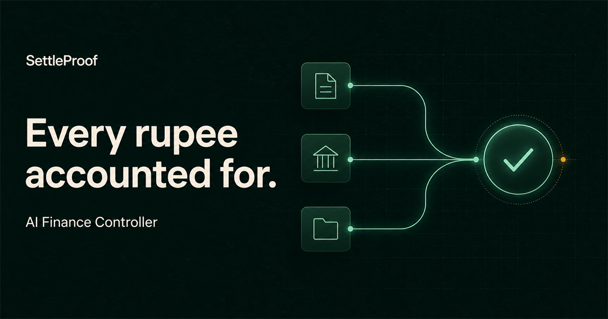
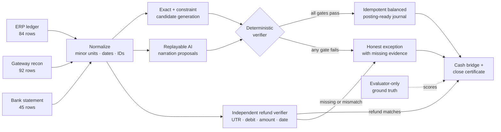

# SettleProof

> Every rupee accounted for. Every exception admitted.

> **The buildathon bar:** “Throughput plus measured accuracy plus an honest exception list. One cherry-picked match proves nothing.”



SettleProof is an evidence-first AI finance controller for Razorpay Buildathon Track 04. It closes one bounded loop:

`ERP order → gateway recon row → settlement batch → bank credit → balanced journal → cash position`

The model is allowed to interpret messy narration and propose a typed reference. It is **not** allowed to do arithmetic or authorize a posting. A deterministic verifier proves every posting intent and abstains when evidence is incomplete or ambiguous. The demo produces posting-ready journals and a close certificate; it does not write to a live ERP or bank.

## Shipped feature set

| Capability | What is implemented |
| --- | --- |
| Three-source payment reconciliation | Links ERP orders, gateway payments, complete settlement groups, and bank credits using exact references, constrained candidates, and fingerprint-bound AI proposals. |
| Independent refund reconciliation | Audits every gateway `refund` separately against a bank debit. A matched payment never suppresses a refund exception. |
| Bring-your-own raw data | Browser-local CSV/JSON ingestion, one-pack import, alias-based column mapping, exact-paise normalization, row validation, SHA-256 manifests, control totals, and a clean **Load another batch** reset. |
| Deterministic posting control | Enforces global one-to-one assignment, cutoff policy, settlement completeness, UTR consistency, bank receipt, integer-paise arithmetic, balanced journals, and stable idempotency IDs. |
| Cash controller | Explains opening cash, verified settlements, verified refund debits, operating movement, cash in transit, duplicate-credit exposure, and closing bank cash. |
| Evidence and exception operations | Provides an inspectable evidence ledger plus one honest queue with reason code, rupee exposure, missing evidence, owner, SLA, and next action. |
| Privacy and secure export | Keeps imported files in-browser, defaults to a raw-data-free proof packet, and offers a confirmed-passphrase AES-256-GCM encrypted full export. |
| Measured verification | Ships reproducible truth-scored metrics, a real AI-disabled ablation, 100 seeded regressions, 19 adversarial controls, a 50,167-row full-loop stress replay, and downloadable proof artifacts. |

## Verified result

All figures below are generated by `npm run evaluate`; none are typed into the dashboard by hand.

| Measure | Result | Denominator |
| --- | ---: | --- |
| Source rows processed | **221** | 84 ERP + 92 gateway + 45 bank |
| Reconciliation targets | **84** | complete target population |
| Correct auto-matches | **78** | independently scored against truth |
| Safe match rate | **92.9%** | 78 correct auto-matches / 84 targets |
| Auto-match precision | **100%** | 78 correct / 78 auto-matches |
| Match recall | **100%** | 78 correct / 78 truly matchable |
| Value-weighted coverage | **87.5%** | correctly closed INR / total target INR |
| Target exceptions surfaced | **6 / 6** | one of each injected payment control break |
| Independent refund control | **4 checked; 3 matched; 1 held** | a clean payment cannot mask a refund failure |
| Unified honest exception list | **7 total** | 6 payment targets + 1 independent refund exception |
| False auto-closes | **0** | unsafe financial writes |
| Rules-only baseline | **63 / 84 (75.0%)** | AI proposals disabled in the real verifier; 7 posting-ready journals |
| Verified proposal path | **78 / 84 (92.9%)** | 9 posting-ready journals; **+17.9 percentage points** over rules only |
| Seeded verifier regression | **100 seeds / 22,100 rows** | fixed topology; values and operating noise vary |
| Automated test suite | **23 / 23 passed** | importer, verifier, refund, journal, export, and fail-closed controls |
| Adversarial control suite | **19 / 19 passed** | deterministic finance-control attacks, including refund failures; zero unsafe writes |
| Close-certificate invariants | **7 / 7 passed** | includes independent refund conservation |
| Stress replay | **50,167 rows · 10,801 rows/sec** | 227 full-loop batches; p95 22.174 ms/batch in [`benchmark.json`](artifacts/benchmark.json) |

The six injected target exceptions and the independent refund exception are not hidden from the rate:

1. ERP payment with no gateway evidence
2. ₹500 gateway/ledger amount variance
3. two same-value candidates with no decisive reference
4. duplicate gateway capture/webhook replay
5. processed settlement missing from the bank
6. one UTR appearing as two bank credits
7. `REF-1059` for matched `ORDER-1059` has no corresponding ₹4,850 bank debit

See the complete machine-readable list in [`exceptions.csv`](artifacts/exceptions.csv). The same exception contract also catches source-level failures—such as orphan gateway payments, unowned settlement components, unexplained settlement-like bank rows, and otherwise unclassified source rows—so they cannot disappear outside the target table. Target and source exceptions share one queue with exposure, owner, SLA, missing evidence, and next action.

### Independent refund reconciliation

Every normalized gateway row with `type == "refund"` enters a separate reconciliation stage, regardless of the original payment result. The verifier looks first for a bank debit with the same settlement UTR, then uses order, amount, and transaction-date context only to diagnose the safest outcome. A valid refund requires bank direction `debit`, exact integer-paise amount equality, and matching UTR when one is supplied.

The stage emits three explicit exception types:

- `refund_missing_bank_debit` — no corresponding bank debit exists;
- `refund_amount_mismatch` — the UTR-linked debit exists but its amount differs; and
- `refund_utr_mismatch` — amount/date/order context finds the debit, but the UTR is wrong or unmatched.

`ORDER-1059` is the regression proof: its original payment closes successfully while `REF-1059` remains independently held for a missing ₹4,850 bank debit. Refund matches and refund exceptions flow into the close summary, cash position, unified exception list, certificate evidence, CSV, and JSON proof exports.

## Run it

Private hosted demo (owner authentication required): [Open SettleProof](https://settleproof-260831.revanthsivakumar1.chatgpt.site/)

Requires Node.js 22.13+ (Node 24 recommended).

```bash
npm ci
npm run dev
```

Open `http://localhost:3000`. Use **Replay 221-row close** for the scored benchmark, or **Use your data** to run the same verifier on local files.

To reproduce every score and artifact:

```bash
npm run evaluate
npm run test
npm run build
```

Or run the complete check:

```bash
npm run verify
```

## Use your own raw data

The dashboard now includes a real browser-local ingestion loop. Files are parsed and reconciled in the browser; they are not uploaded or persisted.

Privacy is fail-closed: the normal proof export omits imported raw rows; the optional full export is encrypted in-browser with AES-256-GCM using a passphrase-derived PBKDF2-HMAC-SHA-256 key (310,000 iterations, random 128-bit salt, and random 96-bit IV). A secure in-app dialog requires a 12+ character passphrase and confirmation; the passphrase is never stored or sent. CSP, no-referrer, no-store, frame-denial, MIME-sniffing, cross-origin, and permissions headers reduce browser attack surface. This protects the implemented local workflow; production key custody and durable encrypted storage remain explicit adapter boundaries.

1. Click **Use your data**.
2. Select three CSV/JSON exports, import one JSON pack, or choose **Load example raw files**.
3. Review the detected field map, source SHA-256 hashes, row counts, control totals, and validation findings.
4. Set the close cutoff and optional opening bank balance.
5. Run the verified close and export its input-bound proof packet.
6. Choose **Load another batch** to return to a fresh Files step; prior file controls and validation state are cleared.

The example-file path serializes the synthetic batch into three raw CSVs and sends all 221 rows through the exact same parser as user files. It does not jump back to the seed.

| Source | Minimum detected fields |
| --- | --- |
| ERP ledger | order ID, booked date, amount, explicit `INR`; receipt/customer/expected settlement optional |
| Gateway recon | type, created date, settlement ID, credit, debit, explicit `INR`; order ID or narration required |
| Bank statement | posted date, credit/debit direction, amount, explicit `INR`; UTR and narration optional |

Missing IDs are derived from SHA-256 row content, ERP settlement IDs are optional, and bank settlement kind is treated as advisory rather than trusted proof. Every row must declare `INR`; missing or non-INR currency blocks the batch. Amounts are converted with string arithmetic to integer paise, and aggregate totals are checked against the safe exact-integer range. Formula-like cells, ambiguous columns, invalid dates, duplicate source IDs, malformed amounts, and files over the row/size limits block the run instead of disappearing.

Custom files do not contain evaluator-only truth labels, so their dashboard deliberately shows operational close rate, value reconciled, row disposition, posting-ready journals, and verifier invariants—never synthetic precision, recall, or false-close claims. In the exported JSON, truth-dependent fields are `null`, not zero and not copied from the benchmark. Measured accuracy remains isolated in **Benchmark & audit**.

## What the demo proves

The interface is a working close command center, not a landing page or chatbot.

- **Close overview** — count- and value-weighted metrics, cash bridge, proof invariants, and residual exposure.
- **Bring-your-own-data wizard** — real CSV/JSON parsing, mappings, validation, control totals, hashes, close policy, and local-only processing.
- **Evidence ledger** — every safe match links ERP, gateway, settlement, bank, policy gates, and its posting-ready journal.
- **Exception inbox** — one target-and-source queue where every abstention includes the exact blocker, missing evidence, exposure, owner, SLA, and safest next action.
- **Benchmark & audit** — 100-seed regression, a true AI-disabled ablation, adversarial controls, formulas, generated throughput, limitations, and downloadable proof files.
- **Proof and exception exports** — a redacted JSON proof packet by default, formula-safe exception CSV, and an optional AES-256-GCM full packet containing raw rows only after passphrase confirmation.

## Architecture



The verifier checks:

1. integer-paise amount equality within the INR-scoped batch;
2. unique assignment and no illegal row reuse;
3. explicit date-window policy;
4. one-to-one candidate assignment independent of source row order;
5. every payment component in a settlement reconciled before any group journal;
6. `Σ gateway credits − Σ gateway debits = settlement bank amount`;
7. one non-empty, consistent settlement UTR and one matching bank credit;
8. balanced debits and credits before an idempotent journal is marked posting-ready.

The seven close-certificate invariants are non-vacuous posting set, record conservation, settlement conservation, bank conservation, ledger conservation, cash-cutoff conservation, and independent refund control. Details: [`docs/ARCHITECTURE.md`](docs/ARCHITECTURE.md).

## Where AI actually contributes

With AI proposals actually disabled, the same verifier safely closes 63 of 84 targets (**75.0% coverage**) and emits seven posting-ready settlement journals. Enabling the fingerprint-bound proposal path closes 78 of 84 (**92.9%**) and emits nine journals: a measured **+17.9 percentage-point** coverage lift and two additional complete settlements without reducing the 100% precision floor. This is a real rerun with `allowAiProposals: false`, not a post-hoc subtraction of rows labelled “AI.”

For a key-free, repeatable judging experience, the repository ships the structured proposal replay in [`lib/ai-proposals.ts`](lib/ai-proposals.ts). Each replay is bound to the complete source narration with SHA-256 and is intentionally separate from both runtime inputs and [`ground_truth.json`](artifacts/ground_truth.json). A live model adapter would produce the same proposal contract; it would still have no posting authority.

This separation is the product thesis:

> The model may propose a match. Only the verifier can close it.

## Synthetic evaluation design

The seeded generator in [`lib/reconciliation.ts`](lib/reconciliation.ts) creates official settlement-like shapes and harder negative cases:

- exact and normalized references;
- missing structured IDs with noisy narration;
- T+1/T+2 timing drift;
- fees, tax, refunds, and adjustments;
- same-value/date hard negatives;
- duplicate captures and duplicate UTR credits;
- a missing bank receipt after a processed settlement;
- untrusted instruction-like text inside a gateway description.

The matcher receives only explicitly INR-scoped ERP, gateway, and bank rows. Truth labels are passed exclusively to the evaluator after reconciliation. The frozen input is [`synthetic_batch.json`](artifacts/synthetic_batch.json); evaluator-only labels are [`ground_truth.json`](artifacts/ground_truth.json).

The 100-seed, 22,100-row suite is a **fixed-topology verifier regression**. It varies values and unrelated operating noise while preserving the scenario grammar and replayed proposal topology. It demonstrates deterministic control stability, not held-out model generalization. A separate 19-case adversarial suite also attacks independent refund debit, amount, and UTR controls; all 19 controls must fail closed.

## Metric contract

- `auto_match_precision = correct auto-matches / all auto-matches`
- `match_recall = correct auto-matches / all truly matchable targets`
- `safe_match_rate = correct auto-matches / all reconciliation targets`
- `value_weighted_coverage = correctly closed INR / total target INR`
- `exception_recall = correctly surfaced injected exceptions / all injected exceptions`

The denominators, raw counts, and formulas are preserved in [`metrics.json`](artifacts/metrics.json). This prevents an easy batch from inflating the result or an abstention from disappearing.

## Proof artifacts

| Artifact | Purpose |
| --- | --- |
| [`run_manifest.json`](artifacts/run_manifest.json) | seed, versions, policy, and SHA-256 input/engine fingerprints |
| [`metrics.json`](artifacts/metrics.json) | formulas, demo score, and seeded regression score |
| [`benchmark.json`](artifacts/benchmark.json) | 100-seed regression, true rules-only ablation, adversarial-control summary, and generated stress result |
| [`matches.jsonl`](artifacts/matches.jsonl) | one evidence-bearing line per auto-match |
| [`exceptions.csv`](artifacts/exceptions.csv) | the complete unresolved population |
| [`close_certificate.json`](artifacts/close_certificate.json) | posting-readiness status and all seven invariant proofs |
| [`synthetic_batch.json`](artifacts/synthetic_batch.json) | frozen runtime inputs, excluding truth |
| [`ground_truth.json`](artifacts/ground_truth.json) | evaluator-only labels |
| [`dispositions.jsonl`](artifacts/dispositions.jsonl) | explicit terminal disposition for every source row |

## Tests and failure discipline

The test suite verifies:

- the batch contains exactly 221 source rows;
- every target reaches one terminal state—matched or exception;
- precision, match rate, all six target exception labels, and the independent refund exception;
- journal balance and stable posting-ready idempotency keys across reruns;
- instruction-like source text cannot bypass the verifier;
- all seven close-certificate invariants pass for the safe posting set;
- quoted CSV fields, BOM/CRLF handling, exact paise conversion, dates, currencies, duplicate IDs, and spreadsheet-formula neutralization;
- the 221-row example files traverse the real importer and retain the benchmark outcome;
- imported truth-dependent metrics remain `null` and never inherit synthetic accuracy claims;
- missing/conflicting UTRs and orphan gateway rows cannot authorize partial settlement journals;
- input manifests bind SHA-256 file hashes, mappings, counts, policy, and canonical data;
- imported target and journal IDs remain stable when source rows are reordered;
- `ORDER-1059` can match while `REF-1059` independently raises `refund_missing_bank_debit`;
- refund missing-debit, amount-mismatch, and UTR-mismatch attacks all fail closed; and
- all 19 adversarial finance-control mutations fail closed with zero unsafe writes.

## Honest limits

- Results are synthetic and do not claim production performance.
- The included AI narration proposals are replayed for reproducibility; no paid model call is required for the demo. This measures the verifier around a fixed proposal topology, not a live model provider.
- The 100 seeds vary amounts and unrelated bank movements while preserving the scenario mix and proposal replay; this is a fixed-topology verifier regression, not model-generalization evidence or a substitute for merchant data.
- Stress throughput is environment-dependent. The generated [`benchmark.json`](artifacts/benchmark.json) is the source of truth for the measured row count, duration, and rows per second; the README does not predict a future run.
- Direct API credentials, webhook signatures, durable storage, maker/checker identity, and live ERP journal writes are explicit production adapter boundaries; browser-local CSV/JSON ingestion and posting-ready journal generation are implemented.
- A reviewed exception remains blocked until new evidence arrives and the verifier is rerun.

## Buildathon handoff

- System design: [`docs/ARCHITECTURE.md`](docs/ARCHITECTURE.md)
- Five-minute pitch: [`docs/PITCH.md`](docs/PITCH.md)
- Submission copy and checklist: [`docs/SUBMISSION.md`](docs/SUBMISSION.md)
- Official challenge: [Razorpay Buildathon](https://razorpay.com/buildathon/)

---

Built for the verification bottleneck: fast enough to process the batch, strict enough to protect the books, and honest enough to say “I don’t know.”
# SettleProof
